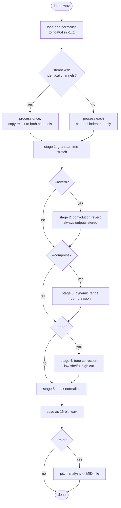
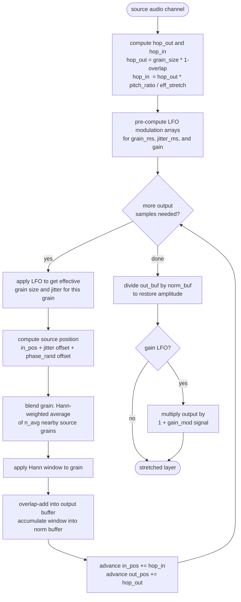

# algorithm

the input audio is stretched by a granular overlap-add engine, processed through up to four independent layers, then passed through optional reverb, compression, and tone correction stages. this document describes each stage in order.

## pipeline overview



---

## stage 1: granular time-stretch

stretches the audio without changing pitch. 100% = 2x the original length, 800% = 9x.

### 1a. layer expansion

the audio is stretched several times in parallel, each with different settings, then mixed. the metaphor is pastry lamination: each layer runs at a slightly different grain size, pitch, and stretch rate.

default layer stack:

| layer | grain size | pitch offset | stretch modifier |
|---|---|---|---|
| foundation | 180 ms | 0 c | 1.00x |
| shimmer | 70 ms | +7 c | 0.85x |
| depth | 220 ms | -12 c | 1.15x |
| dust | 35 ms | +3 c | 0.97x |

with chord mode, the layer stack is copied once per interval, with each copy's `pitch_ratio` multiplied by `2^(semitones/12)`.

### 1b. auto-grain scaling

grain sizes scale up with the stretch factor:

```
effective_grain_ms = grain_ms * stretch_factor^0.2
```

this gives 1x at 1x stretch, ~1.25x at 3x, ~1.55x at 9x.

### 1c. per-layer granular stretch



**rates:**

- `hop_out`: write head advance per grain (`grain_size * (1 - overlap)`)
- `hop_in`: read head advance per grain (`hop_out * pitch_ratio / eff_stretch`)

when `hop_in < hop_out`, the source is read more slowly than the output grows. `pitch_ratio` adjusts `hop_in` independently, so pitch and duration are separate.

**grain blending:**

each output grain is a Hann-weighted average of `n_avg` source grains from a neighbourhood around the current read position. the centre grain has the highest weight; edge grains contribute less.

**jitter and phase randomisation:**

two independent offsets are applied to each grain's source position:

- **jitter** (`jitter_ms`): coarse scatter, applied first
- **phase randomisation** (`phase_rand_ms`): finer scatter applied after jitter, independently per layer, to reduce inter-layer phase coherence

### 1d. mixing layers

layers are summed with their configured gains, trimmed or zero-padded to the same length, then peak-normalised. short cosine fades are applied at the start and end to remove clicks at grain boundaries.

---

## stage 2: convolution reverb (optional)

a synthetic impulse response is generated procedurally. two sections:

**early reflections:** 14 sparse echoes in the first 80 ms after the pre-delay.

**diffuse tail:** exponentially-decaying noise from ~30 ms onward. a one-pole low-pass filter is applied over the tail length (controlled by `damping`). stereo width is set by blending a shared noise signal with per-channel noise.

dry and wet signals are mixed at configurable levels. output is always stereo, and longer than the input by the reverb decay time.

---

## stage 3: dynamic range compression (optional)

soft-knee RMS compressor:

1. compute per-sample RMS envelope with a sliding window
2. map through a soft-knee static compression curve to get gain reduction in dB (always ≤ 0)
3. **attack:** `minimum_filter1d` over a short window holds the maximum reduction so the gain clamps quickly at loud passages
4. **release:** one-pole IIR filter smooths the gain recovery: `y[n] = alpha*x[n] + (1-alpha)*y[n-1]`, where alpha is derived from the release time constant
5. add makeup gain and apply to all channels using the same curve (stereo-linked)

---

## stage 4: tone correction (optional)

two biquad filters in series:

1. **low shelf:** boosts below the corner frequency. Audio EQ Cookbook bilinear-transform, S=1. default: +3.5 dB below 220 Hz.
2. **high cut:** second-order Butterworth low-pass. default: -3 dB at 7500 Hz.

applied per-channel, works on mono or stereo.

---

## stage 5: peak normalisation

scales the output so the peak sample is ±1.0 (0 dBFS). applied after all other stages.

---

## pitch analysis and MIDI export (optional)

runs after the WAV is saved. detects pitches in the output and writes a type-0 MIDI file.

**pitch detection:** YIN algorithm. for each frame, the Cumulative Mean Normalised Difference Function (CMNDF) is computed via FFT autocorrelation. the fundamental period is the first lag that dips below a threshold. parabolic interpolation gives sub-sample accuracy.

**note segmentation:** voiced frames are grouped into segments. a new segment starts when the pitch drifts more than `semitone_tol` semitones from the running median. segments shorter than `min_note_s` are dropped.

**MIDI timing:** the file uses metrical timing. ticks are scaled to match the specified BPM (`--midi-bpm`, default 120). set this to your DAW project tempo before running. import both the WAV and MIDI at bar 1 beat 1.

**note merging:** with `--midi-merge`, consecutive notes at the same pitch separated by less than `--midi-merge-gap` milliseconds (default 500 ms) are collapsed into a single note spanning from the first start to the last end. useful for drone material where the analyser produces short repeated segments of the same pitch.
